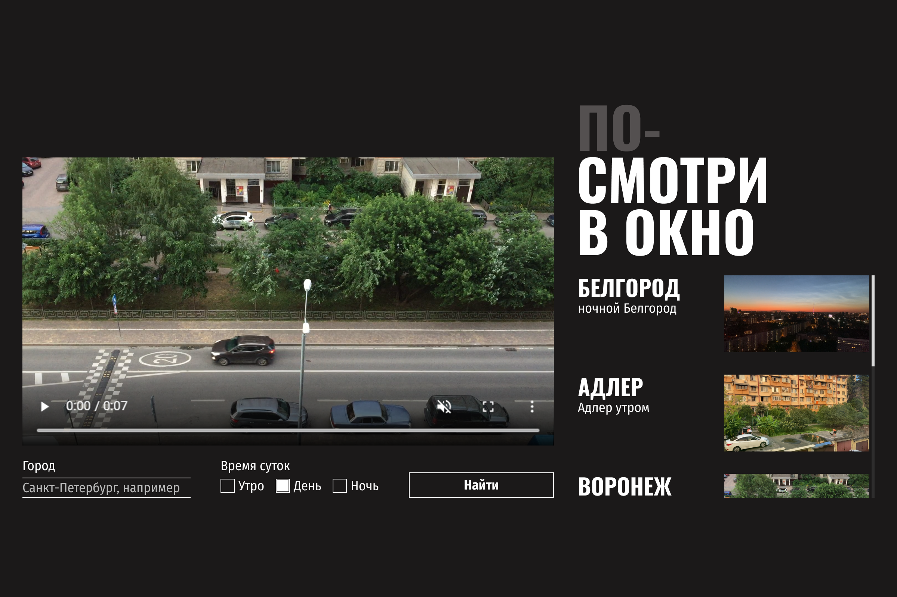

# Посмотри в окно

Интерактивное приложение для поиска и просмотра видео. Стилизация готового работающего приложения — вёрстка лейаута, кастомных элементов форм, состояний интерактивных элементов и позиционирование прелоадеров.

  

## Демо

**[https://vovchensky.github.io/posmotri-v-okno/](https://vovchensky.github.io/posmotri-v-okno-fd/)**

## Технологии

- HTML5 (`<template>`, семантическая разметка)
- CSS3 (Flexbox, кастомный скроллбар, `object-fit`)
- Кастомные чекбоксы и инпуты (псевдоэлементы `::after`, `:checked`, `:has(:focus-visible)`)
- Интерактивные состояния (`:hover`, `:active`, `:focus-visible`)
- Позиционирование прелоадеров (`absolute` / `relative`)
- JavaScript (логика поиска и подгрузки видео — был в заготовке)
